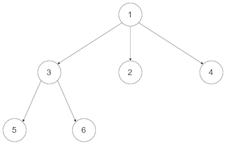
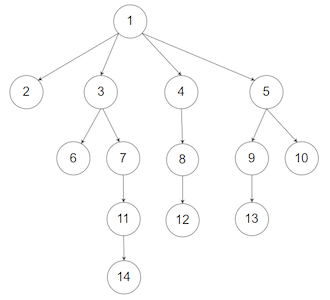

# 429. N-ary Tree Level Order Traversal
## Information
* Date：2020-08-30
* Link：[English](https://leetcode.com/problems/n-ary-tree-level-order-traversal/)/[中文](https://leetcode-cn.com/problems/n-ary-tree-level-order-traversal/)
* Tag：`Tree` `DFS` `BFS`

## Problem Description
Given an n-ary tree, return the level order traversal of its nodes' values.  
Nary-Tree input serialization is represented in their level order traversal, each group of children is separated by the null value (See examples).  
### Example 1:  
  
Input: root = [1,null,3,2,4,null,5,6]  
Output: [[1],[3,2,4],[5,6]]   
### Example 2:  
  
Input: root = [1,null,2,3,4,5,null,null,6,7,null,8,null,9,10,null,null,11,null,12,null,13,null,null,14]  
Output: [[1],[2,3,4,5],[6,7,8,9,10],[11,12,13],[14]]  
### Constraints:
* The height of the n-ary tree is less than or equal to 1000
* The total number of nodes is between [0, 10^4] 

## Solutions
### Analysis
About the Breath First Search(BFS), there are two methods doing it. Recursive solution and Iterative solution.  
In Recursive solution, we can traversal all nodes by preorder and mark a level num to all nodes. Then add the value of node to the corresponding position in list.  
In Iterative solution, we need a queue for saving all nodes. Then get front node one by one.  
### Source Code
#### Java
1.Recursive solution
* Runtime: 2 ms, faster than 89.57% of Java online submissions for N-ary Tree Level Order Traversal.
* Memory Usage: 40.5 MB, less than 62.26% of Java online submissions for N-ary Tree Level Order Traversal.
```Java
/**
 * @author RyuuI
// Definition for a Node.
class Node {
    public int val;
    public List<Node> children;

    public Node() {}

    public Node(int _val) {
        val = _val;
    }

    public Node(int _val, List<Node> _children) {
        val = _val;
        children = _children;
    }
};
*/
class Solution {
    List<List<Integer>> result = new LinkedList<List<Integer>>();
    public List<List<Integer>> levelOrder(Node root) {
        if(root == null)
            return result;

        preorderTraversal(root, 0);
        return result;
    }
    private void preorderTraversal(Node root, int level){
        if(result.size() < level+1){
            result.add(new LinkedList<Integer>());
        }
        result.get(level).add(root.val);
        for(int i=0;i<root.children.size();i++){
            if(root.children.get(i) != null)
                preorderTraversal(root.children.get(i), level+1);
        }
    }
}
```
2.Iterative Solution  
* Runtime: 6 ms, faster than 18.06% of Java online submissions for N-ary Tree Level Order Traversal.
* Memory Usage: 44.1 MB, less than 37.87% of Java online submissions for N-ary Tree Level Order Traversal.
```Java
/**
 * @author RyuuI
// Definition for a Node.
class Node {
    public int val;
    public List<Node> children;

    public Node() {}

    public Node(int _val) {
        val = _val;
    }

    public Node(int _val, List<Node> _children) {
        val = _val;
        children = _children;
    }
};
*/
class Solution {
    public List<List<Integer>> levelOrder(Node root) {
        List<List<Integer>> result = new ArrayList<List<Integer>>();
        if(root == null)
            return result;
        Queue<Node> nodeQueue = new LinkedList<Node>();
        List<Integer> curList = new ArrayList<Integer>();
        nodeQueue.offer(root);
        nodeQueue.offer(null);
        
        while(nodeQueue.size()>1)
        {
            Node curNode = nodeQueue.remove();
            curList.add(curNode.val);
            for(int i =0; i< curNode.children.size();i++)
            {
                nodeQueue.offer(curNode.children.get(i));
            }
            if(nodeQueue.peek() == null)
            {
                result.add(curList);
                curList = new ArrayList<Integer>();
                nodeQueue.remove();
                nodeQueue.offer(null);
            }
        }
        return result;
    }
}
```
#### C
#### C++
#### Python
#### JS
