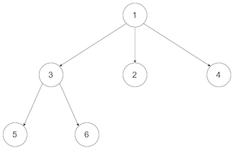
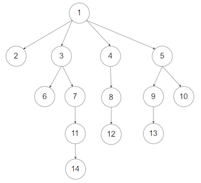

# 589. N-ary Tree Preorder Traversal
## Information
* Date：2020-08-30
* Link：[English](https://leetcode.com/problems/n-ary-tree-preorder-traversal/)/[中文](https://leetcode-cn.com/problems/n-ary-tree-preorder-traversal/)
* Tag：`Tree` `DFS`

## Problem Description
Given an n-ary tree, return the preorder traversal of its nodes' values.  
Nary-Tree input serialization is represented in their level order traversal, each group of children is separated by the null value (See examples).  
Follow up:  
Recursive solution is trivial, could you do it iteratively?  
### Example 1:  
  
Input: root = [1,null,3,2,4,null,5,6]  
Output: [1,3,5,6,2,4]   
### Example 2:  
  
Input: root = [1,null,2,3,4,5,null,null,6,7,null,8,null,9,10,null,null,11,null,12,null,13,null,null,14]  
Output: [1,2,3,6,7,11,14,4,8,12,5,9,13,10]  
### Constraints:
* The height of the n-ary tree is less than or equal to 1000
* The total number of nodes is between [0, 10^4] 

## Solutions
### Analysis
About the Depth First Search(DFS), there are two methods doing it. Recursive solution and Iterative solution. 
In Recursive solution, we can just traversal root -> left childern -> mid children -> ... -> right children.  
In Iterative solution, we need a stack for node. Then push root node and its children node from right to left.  
### Source Code
#### Java
1.Recursive solution
* Runtime: 0 ms, faster than 100.00% of Java online submissions for N-ary Tree Preorder Traversal.
* Memory Usage: 40.5 MB, less than 57.81% of Java online submissions for N-ary Tree Preorder Traversal.
```Java
/**
 * @author RyuuI
// Definition for a Node.
class Node {
    public int val;
    public List<Node> children;

    public Node() {}

    public Node(int _val) {
        val = _val;
    }

    public Node(int _val, List<Node> _children) {
        val = _val;
        children = _children;
    }
};
*/
class Solution {
    List<Integer> result = new ArrayList<Integer>();
    public List<Integer> preorder(Node root) {
        if(root ==null)
            return result;
        recursiveTraversal(root);
        return result;
    }

    private void recursiveTraversal(Node root){
        result.add(root.val);
        for(int i=0; i< root.children.size();i++)
        {
            preorderTraversal(root.children.get(i));
        }
    }
}
```
2.Iterative Solution  
* Runtime: 2 ms, faster than 58.22% of Java online submissions for N-ary Tree Preorder Traversal.
* Memory Usage: 40.1 MB, less than 83.91% of Java online submissions for N-ary Tree Preorder Traversal.
```Java
/**
 * @author RyuuI
// Definition for a Node.
class Node {
    public int val;
    public List<Node> children;

    public Node() {}

    public Node(int _val) {
        val = _val;
    }

    public Node(int _val, List<Node> _children) {
        val = _val;
        children = _children;
    }
};
*/
class Solution {
    public List<Integer> preorder(Node root) {
        Stack<Node> nodeStack = new Stack<Node>();
        List<Integer> result = new ArrayList<Integer>();
        if(root == null)
            return result;
        nodeStack.push(root);
        while(nodeStack.size()>0)
        {
            Node cur = nodeStack.pop();
            result.add(cur.val);
            for(int i = cur.children.size()-1 ; i>=0; i--){
                if(cur.children.get(i) != null){
                    nodeStack.push(cur.children.get(i));
                }
            }
        }
        return result;  
    }
}
```
#### C
#### C++
#### Python
#### JS
